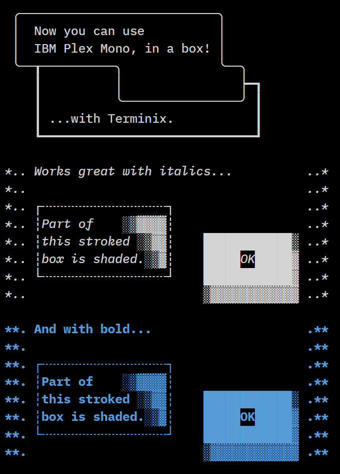

Terminex
========

This is a version of [IBM Plex Mono](https://github.com/IBM/plex) made more
usable in terminals and code editors with two additions:

* slightly darker weight (based on IBM Plex Mono Text)
* [Addition of box drawing characters](https://github.com/adobe-type-tools/box-drawing)
  for use in terminals.

Aside from these changes, there is no difference in the actual glyphs between
these fonts and the original version of IBM Plex Mono - they mainly just contain
metadata modification.

Installation
------------

Install the TTF files in this repo, and reference in your application as
"Terminex"

Source
------

TTF files were taken direclty from [IBM Plex repo](https://github.com/IBM/plex)
and modified using FontForge.
